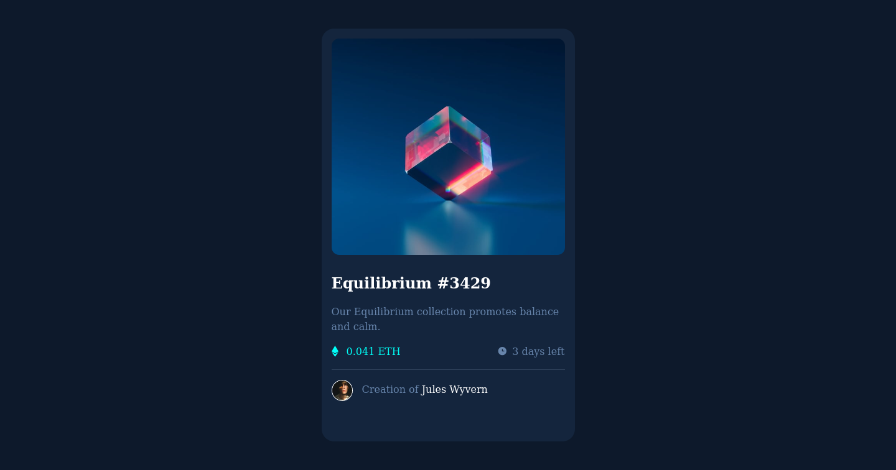

# Frontend Mentor - NFT preview card component solution

This is a solution to the [NFT preview card component challenge on Frontend Mentor](https://www.frontendmentor.io/challenges/nft-preview-card-component-SbdUL_w0U). Frontend Mentor challenges help you improve your coding skills by building realistic projects. 

## Table of contents

- [Overview](#overview)
  - [The challenge](#the-challenge)
  - [Screenshot](#screenshot)
  - [Links](#links)
- [My process](#my-process)
  - [Built with](#built-with)
  - [What I learned](#what-i-learned)
  - [Continued development](#continued-development)
  - [Useful resources](#useful-resources)
- [Author](#author)
- [Acknowledgments](#acknowledgments)

## Overview

### The challenge

Users should be able to:

- View the optimal layout depending on their device's screen size
- See hover states for interactive elements

### Screenshot



### Links

- Solution URL: (https://github.com/ichiklaus/nft-card-component.git)
- Live Site URL: (https://ichiklaus-nft-component-card.netlify.app/)

## My process

### Built with

- Semantic HTML5 markup
- CSS custom properties
- Flexbox
- [Sass-SCSS](https://sass-lang.com/) - For styles

### What I learned

My first project using Sass pre processor. 
    - Mainly, I learnt to structure my project using Sass.
    - I learnt that Sass converts color codes to hex (that's what I saw while working on this project). So, in order to maintain the original color code in HSLA (I needed kept this way otherwise I couldn't set the color to have the right opacity for the hover effect on the card image).

```scss
@function prefix-to-hsla($h, $s, $l, $a) {
@return unquote($string: "hsla(#{$h}, #{$s}, #{$l}, #{$a})");
}
```


### Useful resources

- [How to - Image hover overlay](https://www.w3schools.com/howto/howto_css_image_overlay.asp) - This helped me understand how to apply a image hover overlay effect.
- [Disable converting hsl()/hsla()](https://github.com/sass/sass/issues/469#issuecomment-77290544) - This helped me to write a function to parse the original hsla code color.

## Author

- Frontend Mentor - [@ichiklaus](https://www.frontendmentor.io/profile/ichiklaus)
- Twitter - [@ichiklaus](https://www.twitter.com/ichiklaus)

## Acknowledgments

- [Solution](https://www.frontendmentor.io/solutions/responsive-card-component-using-css-flexbox-tYnF3Eqcg) - ahmed eid's solution helped me to understand how to apply color and set the opacity for the hover effect on the card image.